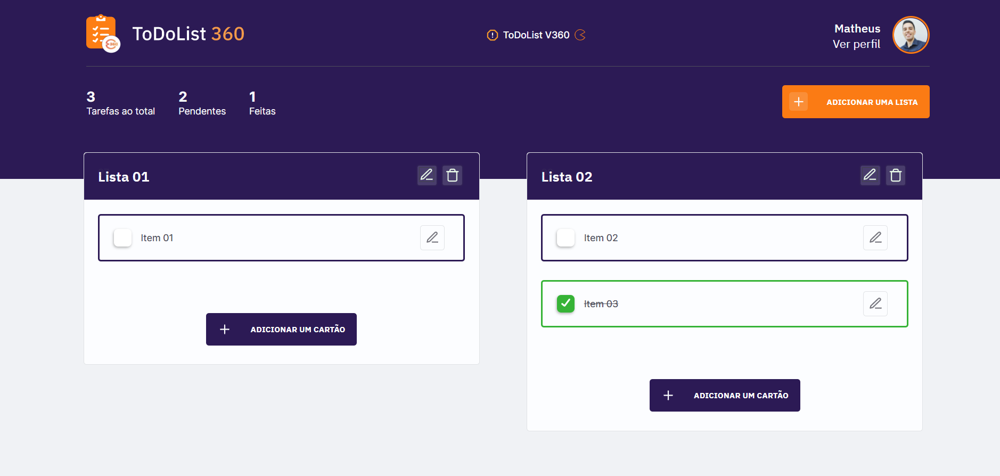
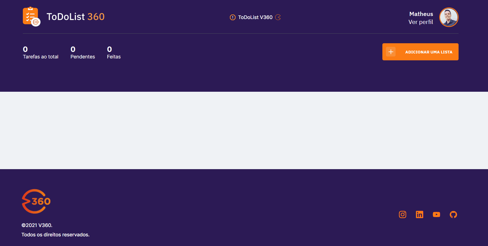

<h2 align="center">
  
  
  
  
</h2>

<h1 align="center">
  
</h1>

<!--INDEX-->
<p align="center">
  <a href="#-sobre-o-projeto">Sobre o projeto</a>&nbsp;&nbsp;&nbsp;|&nbsp;&nbsp;&nbsp;
  <a href="#-screenshots">Screenshots</a>&nbsp;&nbsp;&nbsp;|&nbsp;&nbsp;&nbsp;
  <a href="#rocket-tecnologias">Tecnologias</a>&nbsp;&nbsp;&nbsp;|&nbsp;&nbsp;&nbsp;
  <a href="#-tools">Tools</a>&nbsp;&nbsp;&nbsp;|&nbsp;&nbsp;&nbsp;
  <a href="#-como-executar-o-projeto">Como executar o projeto</a>&nbsp;&nbsp;&nbsp;|&nbsp;&nbsp;&nbsp;
  <a href="#memo-license">License</a>
</p>


<h1 align="center">
  
</h1>


<!-- Tópicos -->

## 💻 Sobre o projeto
- O **ToDoList 360** é uma aplicação de To-Do List no qual é possível criar varias listas de To Do, assim como em cada lista poder ser adicionado vários itens
- Para permanência dos dados, utiliza-se integração com o banco de dados (SQLITE3).

## 📸 Screenshots

<div align="center">
  
</div>

## 🔖 Layout

Você pode visualizar o layout do projeto através do link abaixo:

- [Layout Web](https://www.figma.com/file/lddgAs8TlP9pVFPnkUBXdE/ToDoList--V360?node-id=1%3A2).
- É necessário ter conta no [Figma](https://figma.com) para acessá-lo


## :rocket: Tecnologias

Esse projeto foi desenvolvido com as seguintes tecnologias:

- HTML
- CSS
- JavaScript
- NodeJS
- EJS
- Express
- SQLite

## ⛏ Tools
- [Visual Studio Code](https://code.visualstudio.com/)
- [Beekeeper Studio](https://www.beekeeperstudio.io/)

## 🚀 Como executar o projeto

- Para executar o projeto é necessário ter instalado o Node.Js e o npm

   ```
   - Clone this repository:
   $ git clone https://github.com/matheusfbonfim/ToDoList.git

   - Enter in directory:
   $ cd ToDoList

   - For install dependencies:
   $ npm install

   - Execute application:
   $ npm run dev

   - Open your browser in:
   http://localhost:3000/
   ```

## :memo: License

O projeto está sobre a licença [MIT](./LICENSE) ❤️ 

Gostou? Deixe uma estrelinha para ajudar o projeto ⭐

<!-- Mensagem final -->
<h3 align="center"><br>
Feito com ❤️ por <a href="https://www.linkedin.com/in/matheusfbonfim/">Matheus Bonfim</a>
<br><br>
</h3>
</h3>
